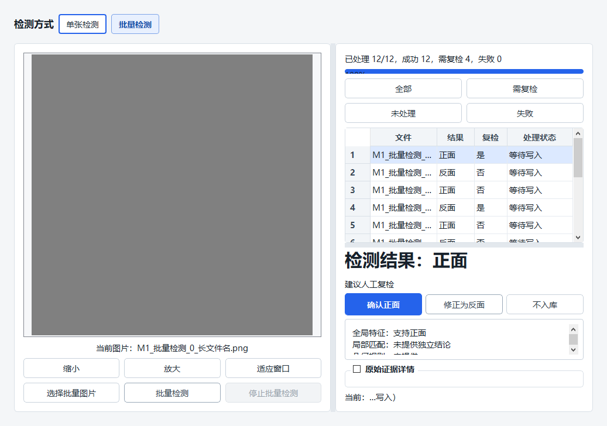

# 后端状态与批量检测布局修复验证结果

日期：2026-08-27

## 修复结果

- 托管后端启动期间统一显示“正在启动”，模型加载阶段显示“正在加载”，连接曾成功后意外中断显示“正在重连”。客户端轮询失败不再把启动状态反复覆盖成“未连接”。
- 后端明确报告启动失败时仍显示终态错误，不会被“正在启动”掩盖。
- 批量检测右栏改为窄栏响应式布局：筛选按钮采用 2×2 排列，结果表位于详情上方，人工处理按钮横向排列。
- 右栏宽度不足时隐藏“耗时”列并缩小结果标题；完整文件名保留在工具提示中，未静默丢失。
- 未修改 PP-ShiTu、ALIKED、LightGlue、融合阈值或后端推理算法。

## 自动化验证

- Qt 完整测试：330 passed，0 failed（10 个测试程序，合计约 33.79 秒）。
- 后端非集成测试：375 passed，3 deselected，耗时 27.76 秒。
- 100% 缩放：检测页响应式用例 5 passed；主窗口 720p 用例 3 passed。
- 125% 缩放：检测页响应式用例 5 passed；主窗口 720p 用例 3 passed。
- 150% 缩放：检测页响应式用例 5 passed；主窗口 720p 用例 3 passed。
- Windows 原生 Qt 截图用例：3 passed，0 failed，耗时 579 ms。
- Qt 5.14.2 Release 构建成功：`qt_app/build-release/release/workpiece_orientation.exe`。

首次在受限环境中运行后端测试时，Windows 临时目录访问被拒绝；使用正常文件权限重跑后全部通过。该错误属于测试运行权限，不是代码回归。

## 视觉检查

在 1037×652 的检测页视口（对应 1085×752 主窗口内的主要内容区域）下，确认以下内容同时可见：

- 批量进度、四个筛选按钮；
- 多行检测结果表；
- 检测结论与复检提示；
- “确认正面”“修正为反面”“不入库”三个按钮；
- 证据摘要与当前文件提示。

截图：
